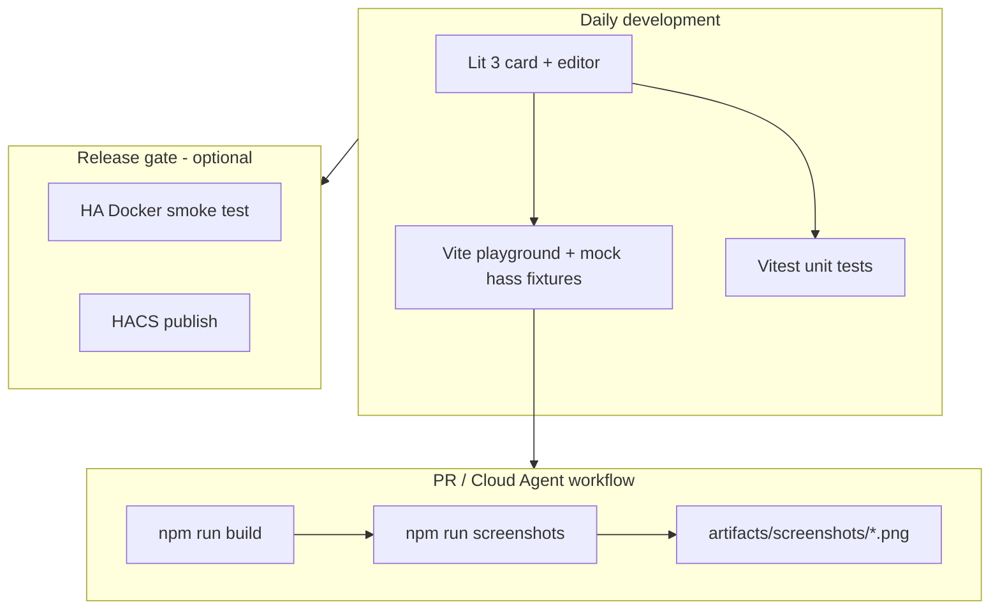

# hacs-toggle-card — Project Plan

> **Status:** Planning  
> **Last updated:** 2026-09-11  
> **Repository:** `hacs-toggle-card` on GitHub

## 1. Overview

**hacs-toggle-card** is a UI-focused Home Assistant custom Lovelace card distributed via HACS. It presents one or more entities as compact toggle rows — ideal for switches, booleans, and other on/off controls in dense dashboard layouts.

### Goals

- Ship a polished, theme-aware toggle-row card with a visual editor
- Keep a **single-component HACS repository** (one integration / one card family)
- Enable **fast, cheap PR screenshots** via Cursor Cloud Agents using a Vite playground + Playwright (no full HA boot per PR)
- Reserve full Home Assistant smoke tests for releases and major UI changes

### Non-goals (v1)

- Monorepo / multi-integration publishing
- Full HA visual regression on every PR
- Backend-heavy custom integration logic (keep Python layer thin)

---

## 2. Architecture



### Stack

| Layer | Technology |
|-------|------------|
| Card UI | Lit 3, TypeScript, Vite |
| Dev / preview | Vite playground with fixture scenes |
| PR screenshots | Playwright (headless Chromium) |
| Backend | Minimal Python custom component (config + entity wiring) |
| Unit tests (UI) | Vitest |
| Unit tests (backend) | pytest + pytest-homeassistant-custom-component |
| HA smoke (release) | ha-testcontainer or hass-taste-test (optional) |

---

## 3. Repository layout

```
hacs-toggle-card/
├── PLAN.md                          # This document
├── README.md                        # User-facing install & config docs
├── AGENTS.md                        # Cursor Cloud Agent instructions
├── hacs.json                        # HACS metadata
├── .gitignore
├── .cursor/
│   └── environment.json             # Cloud agent: Node + Playwright (no Docker)
│
├── custom_components/
│   └── toggle_row_card/             # Thin Python integration (if needed for HACS entity wiring)
│       ├── __init__.py
│       ├── manifest.json
│       ├── strings.json
│       └── www/
│           └── toggle-row-card.js   # Built bundle (copied from frontend/dist)
│
├── frontend/
│   ├── package.json
│   ├── vite.config.ts
│   ├── tsconfig.json
│   ├── src/
│   │   ├── toggle-row-card.ts       # Main card custom element
│   │   ├── toggle-row-card-editor.ts
│   │   ├── types.ts
│   │   └── styles.ts
│   ├── fixtures/
│   │   ├── hass-base.ts             # Shared mock hass shell
│   │   └── scenes/                  # One file per screenshot scene
│   │       ├── default-on.ts
│   │       ├── default-off.ts
│   │       ├── unavailable.ts
│   │       ├── loading.ts
│   │       ├── multi-row.ts
│   │       └── editor.ts
│   ├── playground/
│   │   ├── index.html
│   │   └── main.ts                  # Scene router (?scene=default-on)
│   └── scripts/
│       └── capture-screenshots.ts   # Playwright capture → artifacts/
│
├── tests/
│   ├── unit/                        # Vitest (frontend logic)
│   └── python/                      # pytest (config flow, if any)
│
├── artifacts/
│   └── screenshots/                 # PR output (gitignored)
│
└── .github/
    └── workflows/
        ├── ci.yml                   # lint, test, build
        └── screenshots.yml          # optional: capture on PR label
```

> **Note:** Many Lovelace-only cards ship as frontend plugins without a Python integration. If this card only consumes existing HA entities (no custom platform), the Python layer can be omitted and HACS distributes the JS bundle from `www/` at repo root. Decide during Phase 1 based on HACS category (plugin vs integration).

---

## 4. Card design (v1)

### UX

- Render a vertical list of toggle rows
- Each row: label (entity friendly name or override), optional secondary text/icon, toggle control
- Support single-entity and multi-entity YAML config
- Respect HA themes (CSS custom properties: `--primary-color`, `--card-background-color`, etc.)
- Skeleton / loading state when `hass` is not yet available

### YAML config (draft)

```yaml
type: custom:toggle-row-card
title: Lights
rows:
  - entity: switch.porch
  - entity: switch.garage
    name: Garage override
  - entity: input_boolean.guest_mode
    icon: mdi:account-multiple
```

### Editor

- Visual editor using `ha-entity-picker`, `ha-textfield`, repeaters for row list
- Register in `window.customCards` for card picker discovery
- Implement `getStubConfig()` for card picker preview

---

## 5. Screenshot workflow (Cursor Cloud Agents)

### Why playground over full HA

| Approach | Typical time | Proves |
|----------|--------------|--------|
| Vite playground + Playwright | **15–30 s** | Card UI in defined states |
| Full HA Docker | **2–4 min** | End-to-end in real HA shell |
| computerUse interactive | **8–20 min** | Flexible but slow/expensive |

For a UI-focused card, **playground screenshots are the default**; full HA is release-only.

### Scene list (PR artifacts)

| Scene ID | Purpose |
|----------|---------|
| `default-on` | Single row, switch on |
| `default-off` | Single row, switch off |
| `multi-row` | 3+ rows mixed states |
| `unavailable` | Entity `unavailable` styling |
| `loading` | Card before `hass` attached |
| `editor` | Visual editor open |
| `dark-theme` | Dark theme CSS vars (optional) |

### Commands

```bash
cd frontend
npm ci
npm run build
npm run screenshots
# → ../artifacts/screenshots/*.png
```

### Cloud agent environment (`.cursor/environment.json`)

```json
{
  "install": "cd frontend && npm ci && npx playwright install chromium",
  "terminals": []
}
```

No Docker required for routine agent work — keeps builds fast and cheap.

### AGENTS.md contract

Cloud agents should, after UI changes:

1. Run `npm run build` and `npm run screenshots`
2. Copy key PNGs to walkthrough artifacts for the PR
3. Run `npm test` (Vitest) and fix failures
4. Only spin up HA Docker if config flow or real `ha-selector` editor behavior changed

---

## 6. Mock `hass` strategy

Mock only what the card calls — do not replicate the full HA frontend.

**Minimum mock surface:**

```typescript
interface MockHass {
  states: Record<string, HassEntity>;
  themes: { darkMode: boolean; themes: Record<string, unknown> };
  locale: { language: string };
  callService(domain: string, service: string, data?: object): Promise<void>;
}
```

**Fixture files** export frozen `hass` + `config` pairs per scene. The playground reads `?scene=<id>` and mounts the card.

For the **visual editor**, either:

- Mock `ha-form` / `ha-selector` with simplified stand-ins in the playground, or
- Capture editor screenshots in full HA during release smoke only

---

## 7. Build & HACS packaging

### Build pipeline

```bash
cd frontend && npm run build
# Output: frontend/dist/toggle-row-card.js
# Copy to: custom_components/toggle_row_card/www/  (or repo-root www/)
```

### `hacs.json` (draft)

```json
{
  "name": "Toggle Row Card",
  "content_in_root": false,
  "filename": "toggle-row-card.js"
}
```

Adjust based on final HACS category (integration vs plugin).

### HACS requirements checklist

- [ ] Public GitHub repo with description
- [ ] Valid `hacs.json` at repo root
- [ ] README with install, config, and entity table
- [ ] At least one release (preferred for HACS version picker)
- [ ] Brand assets if publishing as integration (`brand/icon.png`)

---

## 8. Testing strategy

### Tier 1 — Fast (every PR)

| Test | Tool | Target |
|------|------|--------|
| Card logic | Vitest | config parsing, row normalization, state helpers |
| Lint | ESLint + Prettier | frontend |
| Screenshots | Playwright + playground | visual PR evidence |
| Build | Vite | bundle compiles |

### Tier 2 — Backend (every PR, if Python exists)

| Test | Tool | Target |
|------|------|--------|
| Config flow | pytest | setup, validation, errors |
| Manifest | hassfest (optional) | integration metadata |

### Tier 3 — HA smoke (release / manual)

| Test | Tool | Target |
|------|------|--------|
| Card loads in Lovelace | ha-testcontainer or hass-taste-test | resource registration, render |
| Card picker | Full HA | `customCards` registration |
| Theme integration | Full HA | light/dark themes |

---

## 9. Implementation phases

### Phase 0 — Repository bootstrap (this plan)

- [x] Create repo with `PLAN.md`, `README.md`, `AGENTS.md`
- [ ] Add `.cursor/environment.json`
- [ ] Add CI workflow skeleton

### Phase 1 — Card scaffold

- [x] Fork/adapt [custom-cards/boilerplate-card](https://github.com/custom-cards/boilerplate-card)
- [x] Rename to `toggle-row-card` element
- [x] Implement basic single-row toggle render
- [x] Vite build → `dist/toggle-row-card.js`

### Phase 2 — Playground + screenshots

- Fixture scenes (on/off/unavailable/loading/multi-row)
- Playground scene router
- `npm run screenshots` → `artifacts/screenshots/`
- Document in `AGENTS.md`

### Phase 3 — Multi-row + editor

- Multi-entity YAML config
- Visual editor with row repeater
- `getStubConfig()` for card picker
- Dark theme scene

### Phase 4 — HACS packaging

- `hacs.json`, README, brand assets
- First GitHub release
- Manual install verification in HA

### Phase 5 — Polish & release gate

- Vitest coverage for config edge cases
- Optional HA smoke workflow on `release/*` tags
- HACS default store submission (if desired)

---

## 10. Decisions log

| Date | Decision | Rationale |
|------|----------|-----------|
| 2026-09-11 | Single-component repo | Simpler HACS publishing; user preference |
| 2026-09-11 | Vite playground for PR screenshots | UI-focused; 10× faster than full HA for agents |
| 2026-09-11 | Full HA smoke release-only | Cost/speed vs coverage tradeoff |
| 2026-09-11 | Based on boilerplate-card | Production patterns: Lit 3, editor, loading state |
| 2026-09-11 | Pure Lovelace plugin (no Python) | Card only toggles existing entities; Python deferred |
| 2026-09-11 | Toggle-only row interaction | Tap/hold actions deferred to later phase |

### Open questions

1. **HACS category:** Pure Lovelace plugin vs Python integration wrapper?
2. **Row interactions:** Toggle only, or also tap-to-more-info / hold actions?
3. **Screenshot baselines:** Commit reference PNGs in repo, or generate fresh each PR (artifacts only)?

---

## 11. References

- [HA custom card docs](https://developers.home-assistant.io/docs/frontend/custom-ui/custom-card/)
- [custom-cards/boilerplate-card](https://github.com/custom-cards/boilerplate-card)
- [HACS integration requirements](https://www.hacs.xyz/docs/publish/integration/)
- [ha-testcontainer](https://github.com/Lint-Free-Technology/ha-testcontainer) — optional release smoke
- [hass-taste-test](https://github.com/rianadon/hass-taste-test) — optional Node-based HA e2e
- [Cursor Cloud Agent setup](https://cursor.com/docs/cloud-agent/setup)