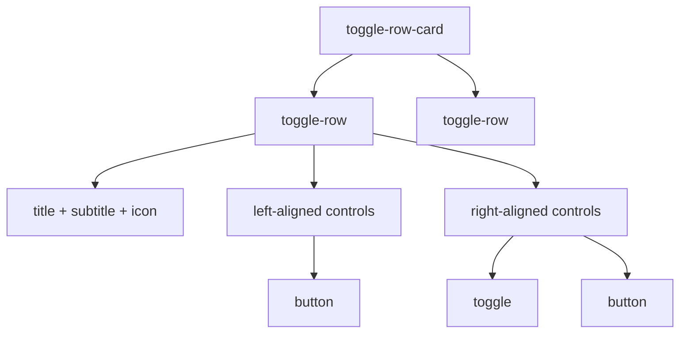
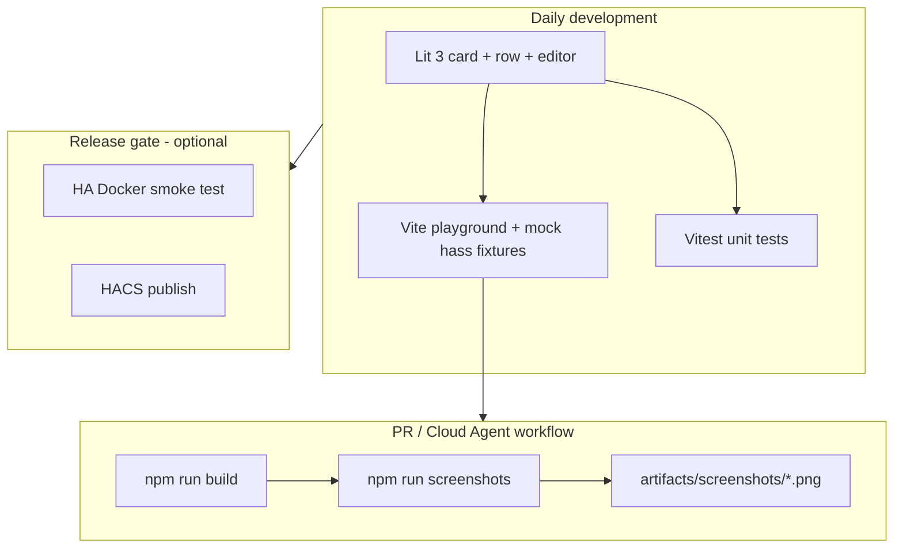

# hacs-toggle-card — Project Plan

> **Status:** Phase 1 complete — row component architecture defined  
> **Last updated:** 2026-09-12  
> **Repository:** `hacs-toggle-card` on GitHub

## 1. Overview

**hacs-toggle-card** is a UI-focused Home Assistant custom Lovelace card distributed via HACS. It renders one or more **reusable row components**, each with a templated title/subtitle, icon, and a flexible set of left- or right-aligned sub-components (buttons and toggles).

Rows are composable building blocks: a card is a vertical list of rows; each row is a self-contained control surface for dense dashboard layouts.

### Goals

- Ship a polished, theme-aware card built from a **reusable row component**
- Support templated title/subtitle, icon, and composable sub-components (buttons, toggles)
- Keep a **single-component HACS repository** (one integration / one card family)
- Enable **fast, cheap PR screenshots** via Cursor Cloud Agents using a Vite playground + Playwright (no full HA boot per PR)
- Reserve full Home Assistant smoke tests for releases and major UI changes

### Non-goals (v1)

- Monorepo / multi-integration publishing
- Full HA visual regression on every PR
- Backend-heavy custom integration logic (keep Python layer thin)

---

## 2. Architecture

### Component model



**`toggle-row-card`** — Lovelace card shell. Owns card-level config, renders a vertical list of rows, and passes `hass` + row config down.

**`toggle-row`** — Reusable row component. Owns row layout, template evaluation, disabled state, and sub-component rendering.

**Sub-components** — Pluggable controls attached to a row. Each declares `align: left | right`. v1 supports:

| Type | Purpose |
|------|---------|
| `button` | Icon and/or title; runs any HA `ActionConfig` |
| `toggle` | Boolean on/off; may disable the entire row when off |

### Dev / delivery architecture



### Stack

| Layer | Technology |
|-------|------------|
| Card UI | Lit 3, TypeScript, Vite |
| Dev / preview | Vite playground with fixture scenes |
| PR screenshots | Playwright (headless Chromium) |
| Backend | Minimal Python custom component (config + entity wiring) |
| Unit tests (UI) | Vitest |
| Unit tests (backend) | pytest + pytest-homeassistant-custom-component |
| HA smoke (release) | ha-testcontainer or hass-taste-test (optional) |

---

## 3. Repository layout

```
hacs-toggle-card/
├── PLAN.md                          # This document
├── README.md                        # User-facing install & config docs
├── AGENTS.md                        # Cursor Cloud Agent instructions
├── hacs.json                        # HACS metadata
├── .gitignore
├── .cursor/
│   └── environment.json             # Cloud agent: Node + Playwright (no Docker)
│
├── custom_components/
│   └── toggle_row_card/             # Thin Python integration (if needed for HACS entity wiring)
│       ├── __init__.py
│       ├── manifest.json
│       ├── strings.json
│       └── www/
│           └── toggle-row-card.js   # Built bundle (copied from frontend/dist)
│
├── frontend/
│   ├── package.json
│   ├── vite.config.ts
│   ├── tsconfig.json
│   ├── src/
│   │   ├── toggle-row-card.ts       # Card shell — renders list of rows
│   │   ├── toggle-row-card-editor.ts
│   │   ├── components/
│   │   │   ├── toggle-row.ts        # Reusable row (title, subtitle, icon, controls)
│   │   │   ├── row-button.ts       # Button sub-component
│   │   │   └── row-toggle.ts       # Toggle sub-component
│   │   ├── templates.ts             # Template-string evaluation for title/subtitle
│   │   ├── types.ts
│   │   └── styles.ts
│   ├── fixtures/
│   │   ├── hass-base.ts             # Shared mock hass shell
│   │   └── scenes/                  # One file per screenshot scene
│   │       ├── default-on.ts
│   │       ├── default-off.ts
│   │       ├── unavailable.ts
│   │       ├── loading.ts
│   │       ├── multi-row.ts
│   │       └── editor.ts
│   ├── playground/
│   │   ├── index.html
│   │   └── main.ts                  # Scene router (?scene=default-on)
│   └── scripts/
│       └── capture-screenshots.ts   # Playwright capture → artifacts/
│
├── tests/
│   ├── unit/                        # Vitest (frontend logic)
│   └── python/                      # pytest (config flow, if any)
│
├── artifacts/
│   └── screenshots/                 # PR output (gitignored)
│
└── .github/
    └── workflows/
        ├── ci.yml                   # lint, test, build
        └── screenshots.yml          # optional: capture on PR label
```

> **Note:** Many Lovelace-only cards ship as frontend plugins without a Python integration. If this card only consumes existing HA entities (no custom platform), the Python layer can be omitted and HACS distributes the JS bundle from `www/` at repo root. Decide during Phase 1 based on HACS category (plugin vs integration).

---

## 4. Card design (v1)

### Row layout

Each row is a horizontal strip:

```
[icon]  title                         [left controls]     [right controls]
        subtitle (optional)
```

- **Title** and **subtitle** are template strings evaluated against `hass` (entity state, attributes, `user`, `states`, etc.)
- **Icon** is a static MDI icon or derived from a referenced entity
- **Controls** are rendered in two alignment groups: `left` and `right`
- When a row is **disabled**, all `button` controls in that row are non-interactive; toggles remain interactive so the user can re-enable the row

### Template strings

Title and subtitle accept HA-style template strings. Examples:

| Template | Resolves to |
|----------|-------------|
| `Porch Light` | Literal string |
| `[[[ return states['switch.porch'].attributes.friendly_name; ]]]` | Entity friendly name |
| `[[[ return states['sensor.temp'].state + '°'; ]]]` | Dynamic value |

Evaluation runs on each `hass` update. Invalid templates surface a row-level warning, not a full card crash.

### Sub-components

#### Button (`type: button`)

- **Content:** `title`, `icon`, or both (at least one required)
- **Action:** any HA `ActionConfig` (`toggle`, `call-service`, `more-info`, `navigate`, `url`, etc.)
- **Alignment:** `left` or `right`
- **Disabled when:** parent row is disabled

```yaml
- type: button
  align: right
  icon: mdi:power
  tap_action:
    action: toggle
    entity: switch.porch
```

#### Toggle (`type: toggle`)

- **Value:** boolean — bound to an entity (`switch.*`, `input_boolean.*`, etc.) or an explicit boolean state
- **Alignment:** `left` or `right`
- **Row disable:** optional `disables_row: true` — when the toggle is `false`/`off`, all buttons in the row are disabled; the toggle itself stays interactive

```yaml
- type: toggle
  align: right
  entity: input_boolean.guest_mode
  disables_row: true
```

### YAML config (draft)

```yaml
type: custom:toggle-row-card
rows:
  - icon: mdi:lightbulb
    title: "[[[ return states['switch.porch'].attributes.friendly_name; ]]]"
    subtitle: "[[[ return states['switch.porch'].state === 'on' ? 'On' : 'Off'; ]]]"
    controls:
      - type: button
        align: left
        icon: mdi:information-outline
        tap_action:
          action: more-info
          entity: switch.porch
      - type: toggle
        align: right
        entity: switch.porch
      - type: button
        align: right
        title: Run
        icon: mdi:play
        tap_action:
          action: call-service
          service: script.porch_scene
          service_data: {}

  - icon: mdi:account-multiple
    title: Guest Mode
    subtitle: Disable automations while guests are home
    controls:
      - type: toggle
        align: right
        entity: input_boolean.guest_mode
        disables_row: true
      - type: button
        align: right
        title: Notify
        tap_action:
          action: call-service
          service: notify.mobile_app
          service_data:
            message: Guest mode changed
```

### TypeScript config shapes (draft)

```typescript
interface ToggleRowCardConfig extends LovelaceCardConfig {
  type: 'custom:toggle-row-card';
  rows: ToggleRowConfig[];
}

interface ToggleRowConfig {
  title: string;
  subtitle?: string;
  icon?: string;
  entity?: string; // optional default entity for template context
  controls: RowControlConfig[];
}

type RowAlign = 'left' | 'right';

interface RowButtonConfig {
  type: 'button';
  align: RowAlign;
  title?: string;
  icon?: string;
  tap_action?: ActionConfig;
  hold_action?: ActionConfig;
  double_tap_action?: ActionConfig;
}

interface RowToggleConfig {
  type: 'toggle';
  align: RowAlign;
  entity: string;
  disables_row?: boolean;
}

type RowControlConfig = RowButtonConfig | RowToggleConfig;
```

### UX rules

- Card renders a vertical list of `toggle-row` elements
- Respect HA themes (CSS custom properties: `--primary-color`, `--card-background-color`, etc.)
- Skeleton / loading state when `hass` is not yet available
- Unavailable entities: row shows muted styling; controls respect availability
- Row disabled state is visual (reduced opacity on buttons) plus `disabled` attribute

### Editor (planned)

- Visual editor using `ha-entity-picker`, `ha-textfield`, repeaters for row list and per-row control list
- Control-type picker (`button` / `toggle`) with alignment selector
- `disables_row` checkbox on toggle controls
- Register in `window.customCards` for card picker discovery
- Implement `getStubConfig()` for card picker preview

---

## 5. Screenshot workflow (Cursor Cloud Agents)

### Why playground over full HA

| Approach | Typical time | Proves |
|----------|--------------|--------|
| Vite playground + Playwright | **15–30 s** | Card UI in defined states |
| Full HA Docker | **2–4 min** | End-to-end in real HA shell |
| computerUse interactive | **8–20 min** | Flexible but slow/expensive |

For a UI-focused card, **playground screenshots are the default**; full HA is release-only.

### Scene list (PR artifacts)

| Scene ID | Purpose |
|----------|---------|
| `default-on` | Single row, toggle on |
| `default-off` | Single row, toggle off |
| `row-with-buttons` | Row with left + right buttons and toggle |
| `row-disabled` | Toggle with `disables_row: true` — buttons disabled |
| `templated-subtitle` | Title/subtitle template strings resolved |
| `multi-row` | 3+ rows mixed states |
| `unavailable` | Entity `unavailable` styling |
| `loading` | Card before `hass` attached |
| `editor` | Visual editor open |
| `dark-theme` | Dark theme CSS vars (optional) |

### Commands

```bash
cd frontend
npm ci
npm run build
npm run screenshots
# → ../artifacts/screenshots/*.png
```

### Cloud agent environment (`.cursor/environment.json`)

```json
{
  "install": "cd frontend && npm ci && npx playwright install chromium",
  "terminals": []
}
```

No Docker required for routine agent work — keeps builds fast and cheap.

### AGENTS.md contract

Cloud agents should, after UI changes:

1. Run `npm run build` and `npm run screenshots`
2. Copy key PNGs to walkthrough artifacts for the PR
3. Run `npm test` (Vitest) and fix failures
4. Only spin up HA Docker if config flow or real `ha-selector` editor behavior changed

---

## 6. Mock `hass` strategy

Mock only what the card calls — do not replicate the full HA frontend.

**Minimum mock surface:**

```typescript
interface MockHass {
  states: Record<string, HassEntity>;
  themes: { darkMode: boolean; themes: Record<string, unknown> };
  locale: { language: string };
  callService(domain: string, service: string, data?: object): Promise<void>;
}
```

**Fixture files** export frozen `hass` + `config` pairs per scene. The playground reads `?scene=<id>` and mounts the card.

For the **visual editor**, either:

- Mock `ha-form` / `ha-selector` with simplified stand-ins in the playground, or
- Capture editor screenshots in full HA during release smoke only

---

## 7. Build & HACS packaging

### Build pipeline

```bash
cd frontend && npm run build
# Output: frontend/dist/toggle-row-card.js
# Copy to: custom_components/toggle_row_card/www/  (or repo-root www/)
```

### `hacs.json` (draft)

```json
{
  "name": "Toggle Row Card",
  "content_in_root": false,
  "filename": "toggle-row-card.js"
}
```

Adjust based on final HACS category (integration vs plugin).

### HACS requirements checklist

- [ ] Public GitHub repo with description
- [ ] Valid `hacs.json` at repo root
- [ ] README with install, config, and entity table
- [ ] At least one release (preferred for HACS version picker)
- [ ] Brand assets if publishing as integration (`brand/icon.png`)

---

## 8. Testing strategy

### Tier 1 — Fast (every PR)

| Test | Tool | Target |
|------|------|--------|
| Card logic | Vitest | config parsing, template evaluation, row disable logic, control normalization |
| Lint | ESLint + Prettier | frontend |
| Screenshots | Playwright + playground | visual PR evidence |
| Build | Vite | bundle compiles |

### Tier 2 — Backend (every PR, if Python exists)

| Test | Tool | Target |
|------|------|--------|
| Config flow | pytest | setup, validation, errors |
| Manifest | hassfest (optional) | integration metadata |

### Tier 3 — HA smoke (release / manual)

| Test | Tool | Target |
|------|------|--------|
| Card loads in Lovelace | ha-testcontainer or hass-taste-test | resource registration, render |
| Card picker | Full HA | `customCards` registration |
| Theme integration | Full HA | light/dark themes |

---

## 9. Implementation phases

### Phase 0 — Repository bootstrap (this plan)

- [x] Create repo with `PLAN.md`, `README.md`, `AGENTS.md`
- [ ] Add `.cursor/environment.json`
- [ ] Add CI workflow skeleton

### Phase 1 — Card scaffold ✅

- [x] Fork/adapt [custom-cards/boilerplate-card](https://github.com/custom-cards/boilerplate-card)
- [x] Rename to `toggle-row-card` element
- [x] Implement basic single-row toggle render (to be refactored in Phase 2)
- [x] Vite build → `dist/toggle-row-card.js`

### Phase 2 — Playground + screenshots (partial ✅)

- [x] Fixture scenes (on/off/unavailable/loading)
- [x] Playground scene router
- [x] `npm run screenshots` → `artifacts/screenshots/`
- [x] Labeled screenshot frames
- [ ] Additional scenes for row-component states (buttons, disabled row, templates)

### Phase 3 — Reusable row component

- Extract `toggle-row` Lit element from current card
- Template-string evaluation for `title` and `subtitle`
- `row-button` sub-component (title, icon, or both; any `ActionConfig`)
- `row-toggle` sub-component (boolean entity binding)
- `disables_row` behavior — toggle off disables all row buttons
- Left/right alignment groups for controls
- Refactor card to render `rows[]` using `toggle-row`
- Vitest: template eval, disable logic, control normalization

### Phase 4 — Multi-row polish + editor

- Multi-row YAML config with rich control examples
- Visual editor with row repeater and per-row control builder
- Control-type picker (button / toggle), alignment selector
- `getStubConfig()` for card picker
- Dark theme scene

### Phase 5 — HACS packaging

- `hacs.json`, README, brand assets
- First GitHub release
- Manual install verification in HA

### Phase 6 — Polish & release gate

- Vitest coverage for config edge cases
- Optional HA smoke workflow on `release/*` tags
- HACS default store submission (if desired)

---

## 10. Decisions log

| Date | Decision | Rationale |
|------|----------|-----------|
| 2026-09-11 | Single-component repo | Simpler HACS publishing; user preference |
| 2026-09-11 | Vite playground for PR screenshots | UI-focused; 10× faster than full HA for agents |
| 2026-09-11 | Full HA smoke release-only | Cost/speed vs coverage tradeoff |
| 2026-09-11 | Based on boilerplate-card | Production patterns: Lit 3, editor, loading state |
| 2026-09-11 | Pure Lovelace plugin (no Python) | Card only toggles existing entities; Python deferred |
| 2026-09-11 | Screenshot baselines artifacts-only | Generate fresh each PR; do not commit PNGs |
| 2026-09-12 | Reusable `toggle-row` component | Rows are composable; card is a list of rows |
| 2026-09-12 | Templated title/subtitle | Dynamic labels via HA template strings |
| 2026-09-12 | Pluggable sub-components | Buttons (any action) and toggles (boolean); left/right aligned |
| 2026-09-12 | `disables_row` on toggles | Toggle off disables all buttons in the row; toggle stays interactive |

### Open questions

1. **Template engine:** Use HA's `renderTemplate` websocket API vs local JS eval for playground?
2. **Future sub-components:** Sliders, selects, badges — add via same `controls[]` extensibility?
3. **Row tap action:** Should the row itself (outside controls) support a default `tap_action`?

---

## 11. References

- [HA custom card docs](https://developers.home-assistant.io/docs/frontend/custom-ui/custom-card/)
- [custom-cards/boilerplate-card](https://github.com/custom-cards/boilerplate-card)
- [HACS integration requirements](https://www.hacs.xyz/docs/publish/integration/)
- [ha-testcontainer](https://github.com/Lint-Free-Technology/ha-testcontainer) — optional release smoke
- [hass-taste-test](https://github.com/rianadon/hass-taste-test) — optional Node-based HA e2e
- [Cursor Cloud Agent setup](https://cursor.com/docs/cloud-agent/setup)